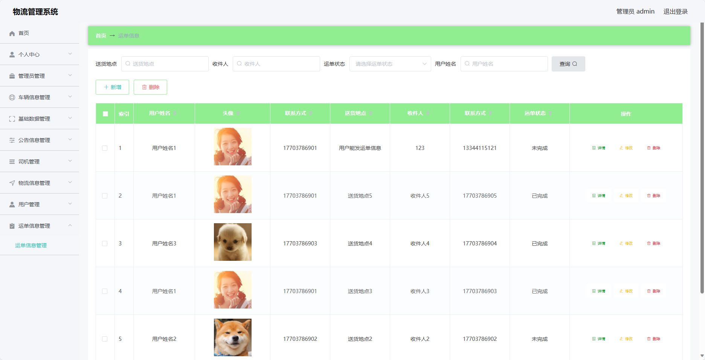

基于SpringBoot的物流管理系统（程序+论文）
=
- 完整代码获取地址：从戎源码网 ([https://armycodes.com/](https://armycodes.com/))
- 作者微信：19941326836  QQ：952045282 
- 承接计算机毕业设计、Java毕业设计、Python毕业设计、深度学习、机器学习
- 选题+开题报告+任务书+程序定制+安装调试+论文+答辩ppt 一条龙服务
- 所有选题地址https://github.com/nature924/allProject

一、项目介绍
---
基于Spring Boot框架实现的物流管理系统，系统包含两种角色：管理员、用户,系统分为前台和后台两大模块，主要功能如下。
### 前台：
- 首页：展示系统的一些基本信息和轮播图。
- 发货单：用户可以填写发货单。
- 公告：展示系统的公告信息。
- 物流跟踪：用户可以根据运单号查询物流信息。
- 个人中心：管理个人信息，包括修改个人信息、查看订单记录等。

### 后台：
- 管理员：
    - 个人中心：管理个人信息，包括修改个人信息、查看订单记录等。
    - 基础数据管理：管理系统的基础数据，包括车辆信息、司机信息、用户信息等。
    - 公告管理：管理系统的公告信息，包括添加、编辑、删除公告等操作。
    - 司机管理：管理系统的司机信息，包括添加、编辑、删除司机等操作。
    - 车辆管理：管理系统的车辆信息，包括添加、编辑、删除车辆等操作。
    - 物流信息管理：管理系统的物流信息，包括物流状态更新等操作。
    - 用户管理：管理系统的用户信息，包括添加、编辑、删除用户等操作。
    - 运单管理：管理系统的运单信息，包括下单、发货、签收等操作。

- 用户：
    - 个人中心：管理个人信息，包括修改个人信息、查看订单记录等。
    - 公告管理：管理系统的公告信息，包括添加、编辑、删除公告等操作。
    - 物流信息管理：管理系统的物流信息，包括查看物流状态、预计到达时间等。
    - 运单管理：管理系统的运单信息，包括下单、发货、签收等操作。

二、项目技术
---
- 编程语言：Java
- 数据库：MySQL
- 项目管理工具：Maven
- 前端技术：VUE、HTML、Jquery、Bootstrap
- 后端技术：Spring、SpringMVC、MyBatis

三、运行环境
---
- 操作系统：Windows、macOS都可以
- JDK版本：JDK1.8以上都可以
- 开发工具：IDEA、Ecplise、Myecplise都可以
- 数据库: MySQL5.7以上都可以
- Tomcat：任意版本都可以
- Maven：任意版本都可以

四、运行截图
---
### 论文截图：

### 程序截图：

